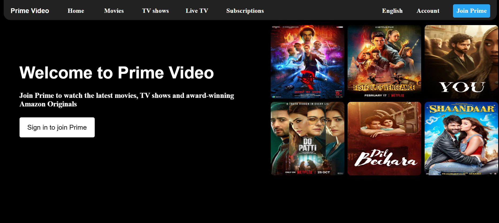

📺 Prime Video UI Clone
A responsive and visually appealing clone of the Prime Video homepage built using HTML and CSS. This project replicates the layout and design elements of Amazon Prime Video, including the navbar, hero banner, movie cards, and footer — perfect for practicing front-end development and UI/UX skills.

🚀 Features
🎬 Homepage layout inspired by Prime Video

🧭 Navigation bar with logo and links

🖼️ Movie/show thumbnails with hover effects

🎞️ Responsive design for desktop, tablet, and mobile

🌙 Dark-themed interface (visually similar to Prime Video)

🛠️ Tech Stack
HTML5 – Semantic and accessible markup

CSS3 – Custom styling for layout and responsiveness

(No frameworks or JavaScript used)

📂 Folder Structure
bash
Copy
Edit
📁 project-root
 ┣ 📁 assets/
 ┃ ┗ 📁 images/        # All images and logos
 ┣ 📁 css/
 ┃ ┗ 📄 style.css      # Main stylesheet
 ┣ 📄 index.html        # Main homepage file
 ┗ 📄 README.md
📸 Screenshot

📌 Notes
This is a static front-end clone created for learning and practice purposes.

